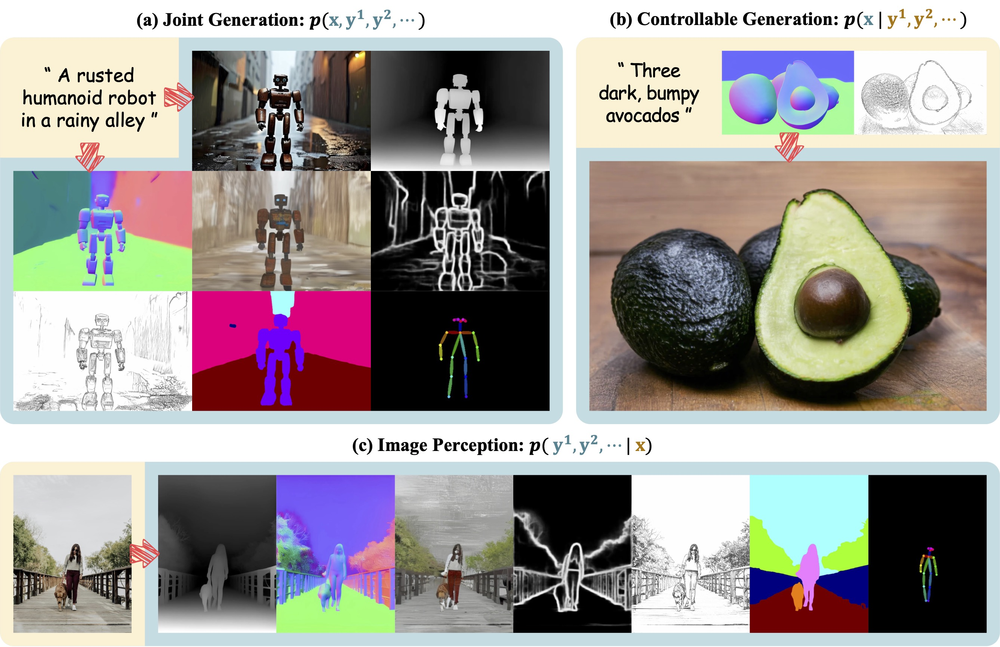

<h1 align="center">
<a href="https://VIPL-GENUN.github.io/Project-Jodi"></a>
</h1>

<a href="https://arxiv.org/abs/2505.19084"></a>
<a href="https://huggingface.co/VIPL-GENUN/Jodi"></a>
<a href="https://VIPL-GENUN.github.io/Project-Jodi"></a>

> **[Jodi: Unification of Visual Generation and Understanding via Joint Modeling](https://arxiv.org/abs/2505.19084)** \
> [Yifeng Xu](https://xyfjason.github.io/homepage)<sup>1,2</sup>, [Zhenliang He](https://lynnho.github.io)<sup>1</sup>, [Meina Kan](https://scholar.google.com/citations?user=4AKCKKEAAAAJ)<sup>1,2</sup>, [Shiguang Shan](https://scholar.google.com/citations?user=Vkzd7MIAAAAJ)<sup>1,2</sup>, [Xilin Chen](https://scholar.google.com/citations?user=vVx2v20AAAAJ)<sup>1,2</sup> \
> <sup>1</sup>State Key Lab of AI Safety, Institute of Computing Technology, CAS, China \
> <sup>2</sup>University of Chinese Academy of Sciences, China

<p align="center">
    
</p>

We introduce Jodi, a diffusion framework that unifies visual generation and understanding by jointly modeling the image domain and multiple label domains. Jodi is built upon a linear diffusion transformer with a role switch mechanism, enabling joint generation, controllable generation, and image perception within a unified diffusion model.


## 💥 News

- **[TODO]**: Release the training code.
- **[TODO]**: Release the Joint-1.6M dataset.
- **[2025-05-27]**: The [arXiv paper](https://arxiv.org/abs/2505.19084), [model weights](https://huggingface.co/VIPL-GENUN/Jodi), and inference code are released.


## 🛠️ Installation

> The code is tested with python 3.10.0, torch 2.4.0, and cuda 12.1.

Clone this repo:

```shell
git clone https://github.com/VIPL-GENUN/Jodi.git
cd Jodi
```

Create and activate a new conda environment:

```shell
conda create -n jodi python=3.10.0 -y
conda activate jodi
```

Install dependencies:

```shell
pip install torch==2.4.0 torchvision==0.19.0 --index-url https://download.pytorch.org/whl/cu121
pip install xformers==0.0.27.post2 --index-url https://download.pytorch.org/whl/cu121
pip install -r requirements.txt
```


## 🤖️ Download Models

We provide our model on [HuggingFace](https://huggingface.co/VIPL-GENUN/Jodi).
The model will be automatically downloaded when you launch the Gradio demo,
or you can download it manually using the following command:

```shell
huggingface-cli download VIPL-GENUN/Jodi
```


## 🚀 Gradio Demo

```shell
python app/jodi_gradio.py --model_path hf://VIPL-GENUN/Jodi/Jodi.pth
```


## 🪧 Acknowledgement

This project is built upon [Sana](https://github.com/NVlabs/Sana). Thanks for their great work!


## ✏️ Citation

If you find this project helpful, please consider citing:

```bibtex
@article{xu2025jodi,
  title={Jodi: Unification of Visual Generation and Understanding via Joint Modeling},
  author={Xu, Yifeng and He, Zhenliang and Kan, Meina and Shan, Shiguang and Chen, Xilin},
  journal={arXiv preprint arXiv:2505.19084},
  year={2025}
}
```
